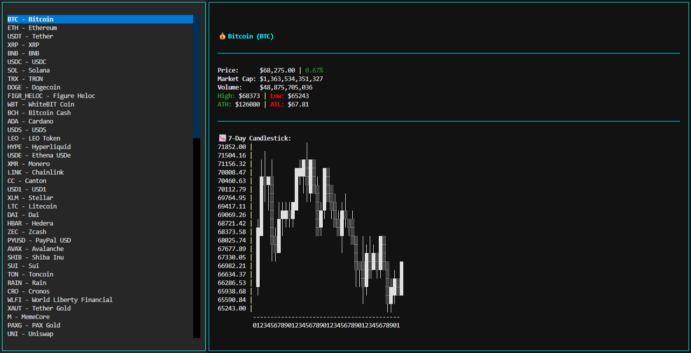

# 🚀 CryptoView


**CryptoApp** is a terminal-based cryptocurrency dashboard built with **Python** and **Textual**. Explore live coin data, track prices, market cap, volume, and view a **7-day ASCII candlestick chart** right in your terminal.



---

## 💡 Features

- Browse **top cryptocurrencies** by market cap
- View detailed coin information:
  - Current price
  - Market capitalization
  - 24h high / low
  - All-time high / low
  - 7-day ASCII candlestick chart

- Dynamic candlestick chart with adjustable width
- Modular, maintainable project structure
- ⚡ One-command setup via `install.sh`

---

## 📂 Project Structure

```bash
CryptoApp/
│
├── main.py                   # Entry point
├── install.sh                # Automated setup script
├── requirements.txt          # Dependencies
├── style/
│   └── style.css             # Terminal UI styling
├── ui/
│   └── crypto_ui.py          # Textual App & UI logic
├── services/
│   └── crypto_service.py     # API requests to CoinGecko
├── utils/
│   └── charts.py             # Candlestick chart generator
├── models/
│   └── coin.py               # Coin data model (dataclass)
└── docs/
    └── preview.png           # App preview image
```

---

## ⚡ Installation

### 🔥 Quick Setup (Recommended)

Use the automated installer:

```bash
chmod +x install.sh
./install.sh
```

The script will:

- Create a virtual environment (if it doesn’t exist)
- Activate it
- Upgrade `pip`
- Install all dependencies
- Display a clean setup confirmation

Once completed, run:

```bash
source venv/bin/activate && python3 main.py
```

---

### 🛠 Manual Installation

1. Clone the repository:

```bash
git clone https://github.com/phlx0/CryptoView.git
cd CryptoView
```

2. Create a virtual environment:

```bash
python3 -m venv venv
source venv/bin/activate   # macOS / Linux
venv\Scripts\activate      # Windows
```

3. Install dependencies:

```bash
pip install -r requirements.txt
```

4. Run the app:

```bash
python3 main.py
```

---

## 🏃 Usage

- Left panel: list of top cryptocurrencies
- Select a coin to view detailed info
- 7-day candlestick chart rendered in ASCII
- Fully terminal-native UI powered by Textual

---

## ⚙️ Dependencies

- Python 3.11+
- Textual – terminal UI framework
- Requests – HTTP requests

---

## 🌟 Future Enhancements

- Color-coded candlesticks for gains/losses
- Sparklines in coin list preview
- Multi-currency support (USD, EUR, BTC)
- Auto-refresh for live market updates
- Windows-compatible install script

---

## 📜 License

MIT License © 2026
See [License](LICENSE)

---

Made with ❤️ Python + Textual
